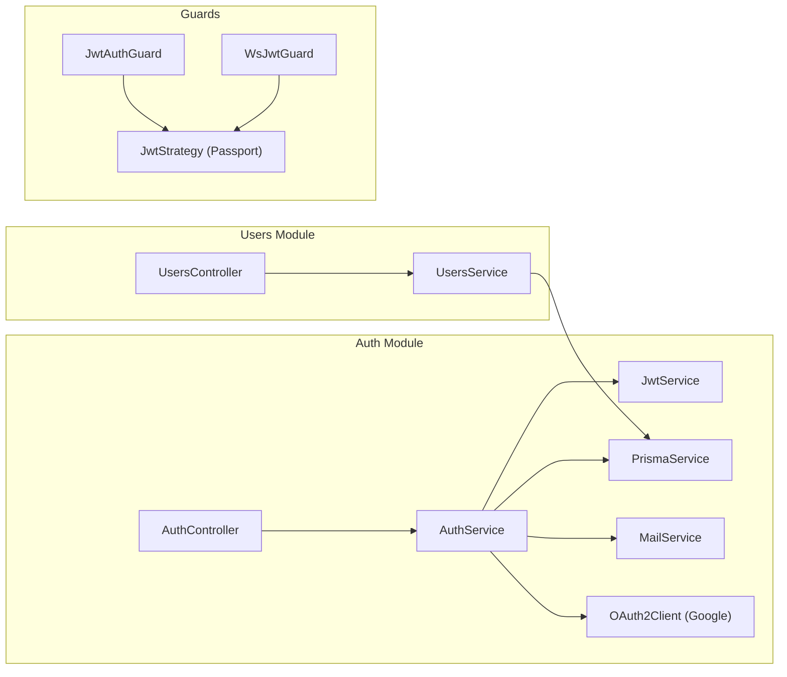
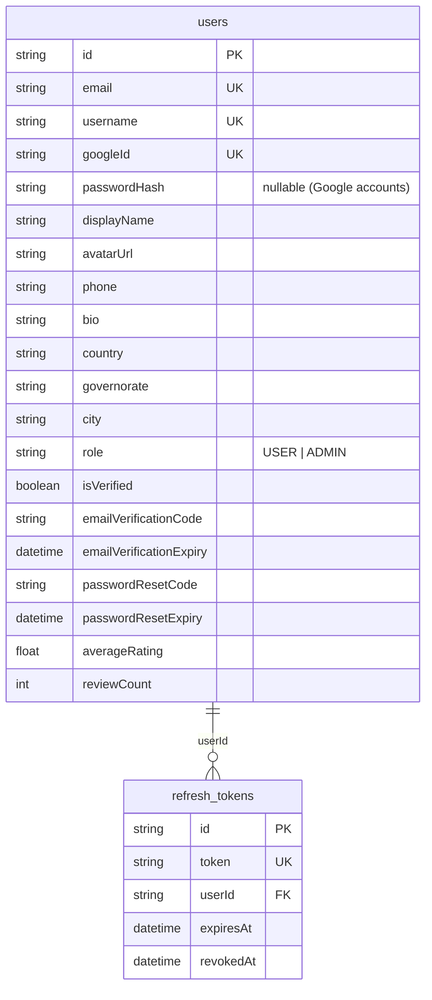

# 🔐 تقرير مراجعة — Auth & Users Module

**النطاق:** Authentication · User Management · JWT · Google OAuth · Email Verification · Password Reset

---

# 1. SYSTEM ARCHITECTURE

---

# 2. BACKEND ANALYSIS

## 2.1 Auth Controller (`/auth`) — 9 endpoints

| Method | Route | Auth | Rate Limit | الوصف |
|--------|-------|:----:|:----------:|-------|
| POST | `/auth/signup` | ❌ | 5/min | تسجيل حساب جديد |
| POST | `/auth/login` | ❌ | 5/min | تسجيل الدخول |
| POST | `/auth/google` | ❌ | - | تسجيل بـ Google OAuth |
| POST | `/auth/refresh` | ❌ | - | تجديد Access Token |
| POST | `/auth/logout` | ❌ | - | تسجيل خروج (revoke refresh) |
| POST | `/auth/verify-email` | ✅ JWT | - | توثيق البريد بالرمز |
| POST | `/auth/resend-verification` | ✅ JWT | 3/min | إعادة إرسال رمز التوثيق |
| POST | `/auth/forgot-password` | ❌ | 3/min | طلب إعادة تعيين كلمة المرور |
| POST | `/auth/reset-password` | ❌ | 5/min | إعادة تعيين كلمة المرور |
| GET | `/auth/me` | ✅ JWT | - | بيانات المستخدم الحالي |

## 2.2 Users Controller (`/users`) — 4 endpoints

| Method | Route | Auth | الوصف |
|--------|-------|:----:|-------|
| GET | `/users/me` | ✅ JWT | ملفي الشخصي (خاص) |
| PATCH | `/users/me` | ✅ JWT | تحديث الملف الشخصي |
| PATCH | `/users/me/password` | ✅ JWT | تغيير كلمة المرور |
| GET | `/users/:id` | ❌ | ملف مستخدم عام |

## 2.3 Auth Service — Business Logic

| Method | الوصف | ملاحظات |
|--------|-------|---------|
| `signup()` | تسجيل + email verification code + JWT | bcrypt hash (salt 10) |
| `login()` | email/password → JWT + refresh token | يميّز حسابات Google |
| `googleAuth()` | Google ID token → create/link user | يربط حسابات بنفس البريد |
| `refresh()` | rotate refresh token (revoke old) | ✅ Token Rotation pattern |
| `verifyEmail()` | مطابقة 6-digit code + 15min expiry | |
| `resendVerification()` | إعادة إرسال كود جديد | |
| `forgotPassword()` | كود 6 أرقام → email | لا يكشف وجود الحساب ✅ |
| `resetPassword()` | email + code + newPassword → hash | |
| `logout()` | revoke refresh token | |

## 2.4 JWT Configuration

| الإعداد | القيمة | الملف |
|---------|--------|-------|
| **Secret** | `JWT_SECRET \|\| 'dev-secret'` | `auth.module.ts`, `jwt.strategy.ts` |
| **Expiration** | `JWT_EXPIRATION \|\| '7d'` | `auth.module.ts` |
| **Refresh Token** | 30 days (DB-stored, revocable) | `auth.service.ts` |
| **Strategy** | Bearer token from Authorization header | `jwt.strategy.ts` |
| **Payload** | `{sub, email, username, role}` | `auth.types.ts` |

## 2.5 Guards

| Guard | الاستخدام | الملف |
|-------|----------|-------|
| `JwtAuthGuard` | REST endpoints | `jwt-auth.guard.ts` — extends Passport `AuthGuard('jwt')` |
| `WsJwtGuard` | WebSocket gateway | `chat.gateway.ts` — manual JWT verify |

## 2.6 Email Service (Mailtrap)

| Template | الوصف |
|----------|-------|
| Verification | رمز 6 أرقام، صالح 15 دقيقة، HTML مع RTL |
| Password Reset | نفس الـ structure مع رسالة مختلفة |

---

# 3. DATABASE MODELS

---

# 4. FRONTEND FILES

| File | الوصف |
|------|-------|
| `app/[locale]/login/page.tsx` | صفحة تسجيل الدخول |
| `app/[locale]/register/page.tsx` | صفحة التسجيل |
| `app/[locale]/register/register-form.tsx` | فورم التسجيل (3 أقسام) |
| `app/[locale]/forgot-password/page.tsx` | نسيت كلمة المرور |
| `app/[locale]/reset-password/page.tsx` | إعادة تعيين |
| `app/[locale]/verify-email/page.tsx` | توثيق البريد |
| `app/[locale]/signup/page.tsx` | redirect → register |
| `app/[locale]/profile/page.tsx` | الملف الشخصي |
| `@modal/(.)login/page.tsx` | modal تسجيل دخول |
| `@modal/(.)register/page.tsx` | modal تسجيل |
| `@modal/(.)forgot-password/page.tsx` | modal نسيت كلمة المرور |
| `components/auth/auth-modal.tsx` | Auth modal wrapper |
| `components/auth/auth-page.tsx` | Auth standalone page |
| `components/auth/auth-layout.tsx` | **DEAD CODE** — لا يوجد imports |
| `lib/auth.ts` | apiRequest wrapper + JWT storage |

---

# 5. ISSUES DETECTION

## 🔴 Security — Critical

| # | المشكلة | الموقع | التفاصيل |
|---|---------|--------|----------|
| A1 | **JWT_SECRET fallback** | `auth.module.ts:12`, `jwt.strategy.ts:12` | `'dev-secret'` يُستخدم لو `JWT_SECRET` فارغ — في production هذا كارثة |
| A2 | **No brute-force protection** | `auth.service.ts:99` | `login()` لا يقفل الحساب بعد محاولات فاشلة — rate limit 5/min لكن بدون lockout |
| A3 | **Verification code is 6-digit numeric** | `auth.service.ts:31` | `Math.random()` بدون crypto — يمكن التخمين (1M combinations فقط) |
| A4 | **No MAILTRAP_API_TOKEN check** | `mail.service.ts:10` | لو التوكن فارغ، الـ emails تفشل بصمت — المستخدم لا يعرف |
| A5 | **Auth controller has direct Prisma** | `auth.controller.ts:18,80` | `me()` endpoint يستخدم `prisma` مباشرة بدل `authService` — يكسر SoC |

## 🟡 Medium

| # | المشكلة | الموقع | التفاصيل |
|---|---------|--------|----------|
| A6 | **Token not encrypted at rest** | `refresh_tokens` table | Refresh token مخزن كـ plain hex — لو تسرب الـ DB يمكن استخدامه |
| A7 | **No refresh token cleanup** | - | الـ tokens المنتهية/الملغاة تتراكم في DB بدون cron cleanup |
| A8 | **Google OAuth no CSRF state** | `auth.service.ts:145` | `verifyIdToken()` بدون nonce/state parameter |
| A9 | **Duplicate `/me` endpoint** | `auth.controller.ts:78` + `users.controller.ts:14` | نفس الـ functionality في مكانين |
| A10 | **Dead code** | `auth-layout.tsx` | ملف بدون imports — يحتاج حذف |

## 🟢 Low

| # | المشكلة | التفاصيل |
|---|---------|----------|
| A11 | No password complexity validation | الـ DTO لا يفرض طول أو تعقيد |
| A12 | No login audit log | لا يسجل محاولات الدخول |
| A13 | No session management UI | لا يمكن للمستخدم رؤية أو إنهاء الجلسات |

---

# 6. PRIORITY FIX PLAN

## 🔴 Critical
| # | الإصلاح | الجهد |
|---|---------|-------|
| 1 | **Enforce JWT_SECRET** — throw on startup if missing | 15min |
| 2 | **Account lockout** — بعد 5 محاولات فاشلة، قفل 15 دقيقة (Redis) | 2h |
| 3 | **Crypto-secure verification code** — `crypto.randomInt(100000, 999999)` | 5min |

## 🟡 Important
| # | الإصلاح | الجهد |
|---|---------|-------|
| 4 | Hash refresh tokens before storing (SHA-256) | 2h |
| 5 | Cron job to cleanup expired/revoked tokens | 1h |
| 6 | Remove duplicate `/me` from auth controller | 15min |
| 7 | Delete `auth-layout.tsx` dead code | 5min |

## 🟢 Nice to Have
| # | الإصلاح | الجهد |
|---|---------|-------|
| 8 | Password complexity rules (min 8, 1 uppercase, 1 digit) | 30min |
| 9 | Login audit log | 2h |
| 10 | Session management page | 4h |

---

# 7. QUICK WINS

| # | Quick Win | الجهد | التأثير |
|---|-----------|-------|---------|
| 1 | `if (!process.env.JWT_SECRET) throw new Error()` | 1 line | 🔴 Critical |
| 2 | `crypto.randomInt(100000, 999999)` بدل `Math.random()` | 1 line | 🔴 Security |
| 3 | Delete `auth-layout.tsx` | 5min | 🟢 Cleanup |
| 4 | Move `me()` from AuthController to UsersController only | 10min | 🟢 SoC |

---

# 8. POSITIVE FINDINGS ✅

- **Token Rotation pattern** — refresh token يتم revoke عند الاستخدام
- **Google account linking** — يربط حسابات بنفس البريد تلقائياً
- **Rate limiting on sensitive routes** — signup, login, forgot-password, resend
- **forgotPassword() safe** — لا يكشف وجود الحساب
- **Arabic error messages** — consistent
- **Separate public/private select** — UsersService يفصل البيانات العامة عن الخاصة
