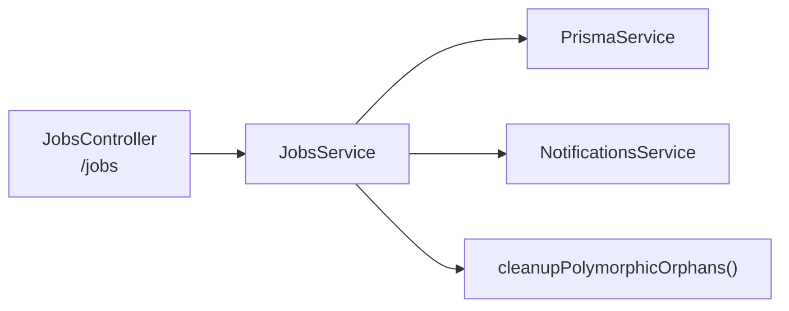
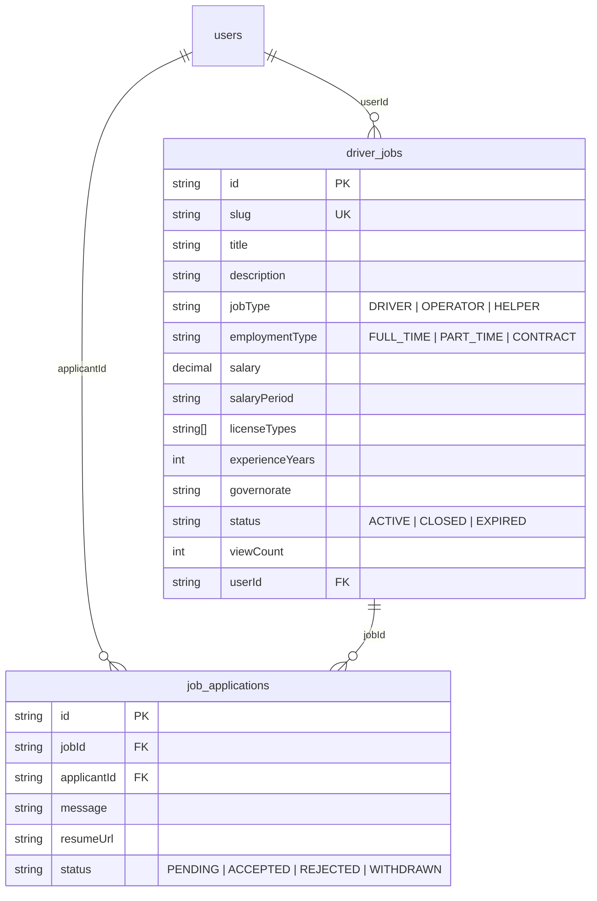

# 💼 تقرير مراجعة — Jobs & Drivers Module

**النطاق:** Driver Jobs · Job Applications · Application Status Management

---

# 1. ARCHITECTURE

**DB Models:** `DriverJob`, `JobApplication`

---

# 2. BACKEND ANALYSIS

## 2.1 Jobs Controller (`/jobs`) — 8 endpoints

| Method | Route | Auth | الوصف |
|--------|-------|:----:|-------|
| POST | `/jobs` | ✅ | إنشاء وظيفة |
| GET | `/jobs` | ❌ | تصفح الوظائف (paginated + filtered) |
| GET | `/jobs/my` | ✅ | وظائفي |
| GET | `/jobs/:id` | ❌ | تفاصيل وظيفة |
| PATCH | `/jobs/:id` | ✅ | تحديث (owner) |
| DELETE | `/jobs/:id` | ✅ | حذف (owner) |
| POST | `/jobs/:id/apply` | ✅ | التقديم على وظيفة |
| GET | `/jobs/:id/applications` | ✅ | عرض الطلبات (owner) |
| PATCH | `/jobs/applications/:id` | ✅ | تغيير حالة طلب (ACCEPTED/REJECTED) |

## 2.2 Service Layer Analysis

| الجانب | التقييم |
|--------|---------|
| **Repository Layer** | ❌ Direct Prisma |
| **Redis Cache** | ❌ لا يوجد |
| **Meilisearch** | ❌ لا يوجد — يستخدم `ILIKE` |
| **State Machine** | ❌ لا يوجد validation لتغيير حالة الطلب |
| **Pagination** | ✅ `findAll()` مع page + limit |
| **Authorization** | ✅ owner check لـ update/delete/view applications |
| **Duplicate prevention** | ✅ `@@unique([jobId, applicantId])` |
| **Self-apply check** | ✅ يمنع المالك من التقديم على وظيفته |
| **Notifications** | ✅ إشعار لصاحب الوظيفة عند التقديم + للمتقدم عند القبول/الرفض |
| **Orphan cleanup** | ✅ `cleanupPolymorphicOrphans('JOB', id)` عند الحذف |

## 2.3 Filters & Sorting

| Filter | الحقل | النوع |
|--------|-------|-------|
| `search` | title, description | `ILIKE` |
| `jobType` | exact match | |
| `employmentType` | exact match | |
| `governorate` | exact match | |
| `licenseType` | `has` (array) | |
| `sortBy` | createdAt, salary, experienceYears, viewCount | |
| `sortOrder` | asc/desc | |

---

# 3. DATABASE MODELS

---

# 4. FRONTEND FILES

| File | الوصف |
|------|-------|
| `app/[locale]/jobs/page.tsx` | قائمة الوظائف |
| `app/[locale]/jobs/[id]/page.tsx` | تفاصيل وظيفة |
| `app/[locale]/jobs/my/page.tsx` | وظائفي |
| `app/[locale]/jobs/new/page.tsx` | إنشاء وظيفة |
| `app/[locale]/add-listing/job/page.tsx` | إضافة وظيفة (بديل) |
| `features/jobs/` | مكونات الوظائف |

---

# 5. ISSUES DETECTION

## 🔴 Critical

| # | المشكلة | الموقع | التفاصيل |
|---|---------|--------|----------|
| J1 | **viewCount manipulation** | `jobs.service.ts:134` | يزيد مع كل GET بدون rate-limit |
| J2 | **No status transition validation** | `jobs.service.ts:256` | `updateApplicationStatus()` يقبل أي `ApplicationStatus` — يمكن الرجوع من REJECTED إلى PENDING |
| J3 | **myJobs() without pagination** | `jobs.service.ts:191` | يرجع كل الوظائف بدون limit |

## 🟡 Medium

| # | المشكلة | الموقع | التفاصيل |
|---|---------|--------|----------|
| J4 | **No Meilisearch** | `jobs.service.ts:86` | البحث بـ `ILIKE` — بطيء مع آلاف الوظائف |
| J5 | **No Redis cache** | - | كل request يضرب DB مباشرة |
| J6 | **Duplicated slugify()** | `jobs.service.ts:23` | نسخة مختلفة عن باقي الـ services |
| J7 | **Manual field mapping** | `jobs.service.ts:148-173` | 25+ lines من `...(dto.x && {x: dto.x})` |
| J8 | **resumeUrl not validated** | `apply-job.dto.ts` | لا يتحقق من نوع الملف أو حجمه |

## 🟢 Low

| # | المشكلة | التفاصيل |
|---|---------|----------|
| J9 | No job expiry cron | الوظائف لا تنتهي تلقائياً |
| J10 | No application withdrawal | المتقدم لا يستطيع سحب طلبه |

---

# 6. PRIORITY FIX PLAN

| Priority | # | الإصلاح | الجهد |
|----------|---|---------|-------|
| 🔴 | 1 | **Application status state machine** — PENDING→ACCEPTED/REJECTED only | 1h |
| 🔴 | 2 | **viewCount rate-limit** — Redis INCR per IP+jobId | 2h |
| 🔴 | 3 | **Add pagination to myJobs()** | 15min |
| 🟡 | 4 | Add Meilisearch index for jobs | 3h |
| 🟡 | 5 | Add Redis cache (5min TTL) | 2h |
| 🟢 | 6 | Job expiry cron (30 days) | 1h |
| 🟢 | 7 | Application withdrawal endpoint | 1h |

---

# 7. POSITIVE FINDINGS ✅

- **Unique constraint** على `jobId_applicantId` — يمنع التكرار
- **Self-apply prevention** — المالك لا يقدر يقدم على وظيفته
- **Notification on application** — صاحب الوظيفة يتلقى إشعار
- **Notification on status change** — المتقدم يتلقى إشعار عند القبول/الرفض
- **Orphan cleanup** — محادثات ومفضلات تُحذف مع الوظيفة
- **Sorting options** — 4 حقول مع asc/desc
