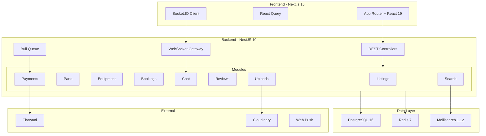
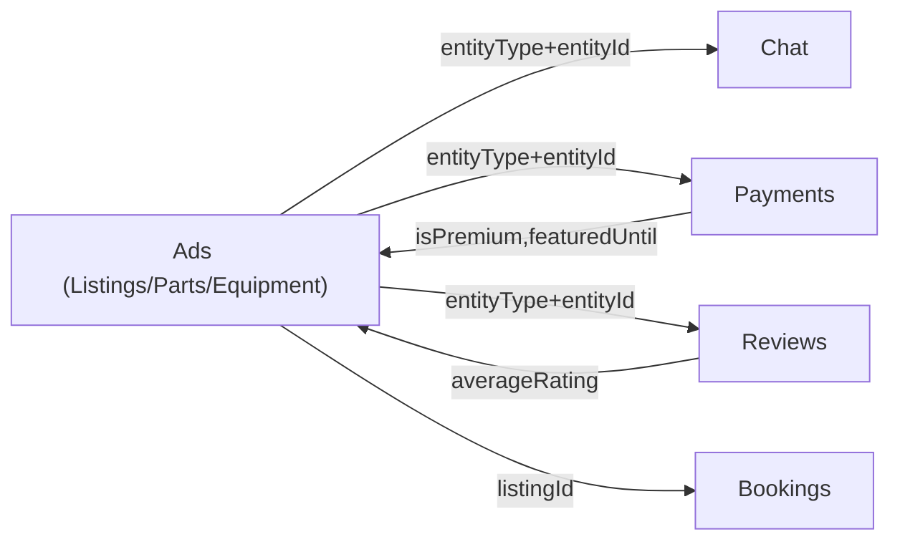
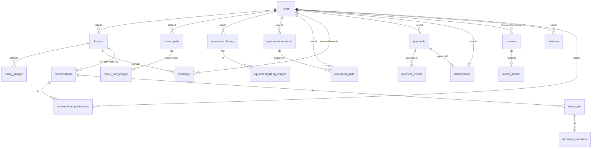

# 🔍 تقرير المراجعة التقنية الشاملة — Full Technical Audit Report

**المنصة:** SouqOne — منصة إعلانات مبوبة (سلطنة عمان 🇴🇲)
**التاريخ:** 14 أبريل 2026
**النطاق:** Selling · Buying · Renting · Spare Parts · Equipment
**المراجع:** Senior Software Architect / System Designer

---

# 1. SYSTEM ARCHITECTURE

## 1.1 نوع المعمارية
**Modular Monolith** — NestJS 10 backend + Next.js 15 frontend في Turborepo monorepo.

## 1.2 Architecture Diagram

## 1.3 Data Flow Between Systems

الربط عبر **Polymorphic Pattern** (`entityType` + `entityId`) — مرن لكن بدون FK constraints.

---

# 2. FRONTEND ANALYSIS

## 2.1 Pages per Module

| Module | Pages | Key Files |
|--------|-------|-----------|
| **Selling** | 7 | `listings/page.tsx`, `add-listing/car/`, `my-listings/`, `edit-listing/` |
| **Buying** | 5 | `listings/[id]/`, `parts/`, `equipment/`, `favorites/`, `seller/[id]/` |
| **Renting** | 3 | `rentals/page.tsx`, `bookings/`, `bookings/[id]/` |
| **Parts** | 2 | `parts/page.tsx`, `parts/[id]/` |
| **Equipment** | 4 | `equipment/page.tsx`, `equipment/[id]/`, `equipment/requests/`, `equipment/operators/` |
| **Chat** | 2 | `messages/page.tsx`, `messages/[id]/` |
| **Payments** | 3 | `payment/success/`, `payment/cancel/`, `pricing/` |

## 2.2 State Management
- **React Query** — الأساسي لكل API calls (custom hooks في `lib/api/`)
- **Local useState** — forms, filters, modals
- **Socket.IO** — real-time chat
- لا يوجد Redux أو Zustand — **✅ مناسب لهذا النوع من التطبيقات**

## 2.3 مشاكل Frontend

| المشكلة | التفاصيل | الخطورة |
|---------|----------|---------|
| `listings/page.tsx` = **35KB** | ملف واحد ضخم بكل الـ filters + grid + map | 🟡 |
| `equipment/page.tsx` = **20KB** | نفس المشكلة | 🟡 |
| لا يوجد shared ListingCard | كل صفحة تعرض cards بشكل مختلف | 🟡 |
| Socket auto-join all conversations | 200+ محادثة = 200 room join عند الاتصال | 🟡 |

---

# 3. BACKEND ANALYSIS

## 3.1 Controllers Summary (69 endpoint)

| Controller | Route | Endpoints | Auth |
|------------|-------|:---------:|:----:|
| Listings | `/listings` | 7 | 4/7 |
| Parts | `/parts` | 6 | 4/6 |
| Equipment | `/equipment` | 9 | 6/9 |
| Equipment Requests | `/equipment-requests` | 10 | 7/10 |
| Bookings | `/bookings` | 7 | 5/7 |
| Chat | `/chat` | 9 | 9/9 |
| Reviews | `/reviews` | 4 | 2/4 |
| Payments | `/payments` | 8 | 5/8 |
| Uploads | `/uploads` | 9 | 8/9 |

## 3.2 Service Layer Analysis

| Service | Repository | Redis Cache | Search Sync | State Machine |
|---------|:---:|:---:|:---:|:---:|
| Listings | ✅ | ✅ | ✅ Meili | ❌ |
| Parts | ❌ | ❌ | ✅ Meili | ❌ |
| Equipment | ❌ | ❌ | ❌ | ❌ |
| Bids | ❌ | ✅ Rate limit | ❌ | ❌ |
| Bookings | ✅ | ❌ | ❌ | ✅ |
| Chat | ❌ | ❌ | ❌ | ❌ |
| Reviews | ❌ | ❌ | ❌ | ❌ |
| Payments | ❌ | ❌ | ❌ | ✅ |

## 3.3 Separation of Concerns Issues

- **Missing Repository Layer** — Parts, Equipment, Chat, Reviews تستخدم Prisma مباشرة
- **Duplicated `generateSlug()`** — في 3+ services
- **Fat ChatService** — 406 lines, 12 methods
- **Gateway breaks encapsulation** — `chat.gateway.ts:105` → `this.chatService['prisma']`
- **No DTO for Parts update** — يستخدم `Partial<CreatePartDto>`
- **JwtPayload redefined locally** — في reviews.controller + payments.controller

## 3.4 Middleware
- `JwtAuthGuard` — JWT verification
- `ThrottlerGuard` — Global 60 req/min
- `@Throttle()` — Per-route (payments: 5/min)
- `ValidationPipe` — DTO validation (global)
- `WsJwtGuard` — WebSocket auth

---

# 4. DATABASE ANALYSIS

## 4.1 ERD Diagram

## 4.2 Indexing — ⚠️ ناقص

| Table | Missing Index | التأثير |
|-------|--------------|--------|
| `conversations` | composite on `(entityType, entityId)` + participants | بطء `createOrGetConversation()` |
| `messages` | `(conversationId, senderId, createdAt)` composite | بطء unread count |
| `spare_parts` | GIN index on `compatibleMakes` | `has` operator بطيء |

## 4.3 Normalization Issues
- **6 image tables متكررة** بنفس الـ structure — يمكن توحيدها
- **Backward compat columns** — `conversations.listingId` + `favorites.listingId` redundant
- **Denormalized `averageRating`** على User — ✅ مقبول لـ performance

---

# 5. API DESIGN

## 5.1 REST Issues

| المشكلة | الموقع | التوصية |
|---------|--------|---------|
| `POST /payments/subscription/cancel` | Cancel ليس creation | `DELETE /payments/subscription` |
| `GET /payments/verify/:sessionId` | Verify يعمل side-effects | `POST /payments/verify` |
| No API versioning | `/api/*` | `/api/v1/*` |
| No global exception filter | - | Custom filter + consistent error shape |

## 5.2 Consistent Patterns ✅
- Pagination: `{items, meta: {total, page, limit, totalPages}}`
- Arabic error messages throughout
- Proper HTTP status codes (400, 403, 404)
- DTO validation with class-validator

---

# 6. EXTERNAL SERVICES

| Service | Usage | Config |
|---------|-------|--------|
| **Thawani** | Payment gateway (sessions, webhooks) | `THAWANI_API_URL`, `THAWANI_SECRET_KEY` |
| **Cloudinary** | Image upload (stream, auto-quality) | `CLOUDINARY_CLOUD_NAME/KEY/SECRET` |
| **Meilisearch** | Full-text search (6 indexes) | `MEILI_HOST`, `MEILI_API_KEY` |
| **Redis** | Cache + Pub/Sub + rate limiting + Socket adapter | `REDIS_URL` |
| **Web Push** | VAPID push notifications | `VAPID_PUBLIC_KEY`, `VAPID_PRIVATE_KEY` |
| **Mailtrap** | Email (auth flows) | Mail config |
| ❌ **SMS** | **غير موجود** — مطلوب لسوق عمان | - |

**⚠️ Equipment لا يستخدم Meilisearch** — بحث بـ `ILIKE` فقط.

---

# 7. CRITICAL INTEGRATIONS

## 7.1 Ads ↔ Chat

**كيف يبدأ المستخدم محادثة:**
1. يضغط "تواصل" → `POST /chat/conversations {entityType, entityId}`
2. API يحل صاحب الإعلان عبر `resolveEntityOwner()` (switch على 10 أنواع)
3. يبحث عن محادثة موجودة → يرجعها أو ينشئ جديدة
4. الربط مخزن في `conversations.entityType` + `conversations.entityId`

**⚠️ مشكلة:** لا يوجد unique constraint على مستوى DB — race condition ممكن يولد duplicate conversations.

## 7.2 Ads ↔ Payment

**Flow:**
1. `POST /payments/featured` → fraud check → create PENDING payment → Thawani session → PROCESSING
2. User يدفع على Thawani → redirect to success page
3. `GET /payments/verify/:sessionId` → check Thawani → PAID → set `isPremium=true, featuredUntil=+30d`
4. Webhook backup: `POST /payments/webhook` → Bull queue (3 retries) → same flow

**State Machine:** `PENDING → PROCESSING → PAID → REFUNDED` (with FAILED/EXPIRED terminals)

## 7.3 Ads ↔ Ratings

**الحالة:** التقييم متاح لأي مستخدم في أي وقت — **لا يوجد verification** أن المستخدم فعلاً تعامل مع البائع.

- `Review.entityType/entityId` → يربط بالإعلان
- `Review.revieweeId` → يربط بالبائع
- `recalculateUserRating()` → يحدّث `User.averageRating`

**⚠️ مشكلة حرجة:** يمكن لأي مستخدم إنشاء fake reviews.

---

# 8. FILE MAPPING

## Backend

| Type | Path |
|------|------|
| **Controllers** | |
| Listings | `apps/api/src/listings/listings.controller.ts` |
| Parts | `apps/api/src/parts/parts.controller.ts` |
| Equipment | `apps/api/src/equipment/equipment.controller.ts` |
| Equip Requests | `apps/api/src/equipment/equipment-requests.controller.ts` |
| Operators | `apps/api/src/equipment/operators.controller.ts` |
| Bookings | `apps/api/src/bookings/bookings.controller.ts` |
| Chat | `apps/api/src/chat/chat.controller.ts` |
| Chat WS | `apps/api/src/chat/chat.gateway.ts` |
| Reviews | `apps/api/src/reviews/reviews.controller.ts` |
| Payments | `apps/api/src/payments/payments.controller.ts` |
| Admin Payments | `apps/api/src/payments/admin-payments.controller.ts` |
| Uploads | `apps/api/src/uploads/uploads.controller.ts` |
| **Services** | |
| Listings | `apps/api/src/listings/listings.service.ts` |
| Listings Repo | `apps/api/src/listings/listings.repository.ts` |
| Parts | `apps/api/src/parts/parts.service.ts` |
| Equipment | `apps/api/src/equipment/equipment-listings.service.ts` |
| Equip Requests | `apps/api/src/equipment/equipment-requests.service.ts` |
| Bids | `apps/api/src/equipment/equipment-bids.service.ts` |
| Operators | `apps/api/src/equipment/operators.service.ts` |
| Bookings | `apps/api/src/bookings/bookings.service.ts` |
| Bookings Repo | `apps/api/src/bookings/bookings.repository.ts` |
| Chat | `apps/api/src/chat/chat.service.ts` |
| Reviews | `apps/api/src/reviews/reviews.service.ts` |
| Payments | `apps/api/src/payments/payments.service.ts` |
| Thawani | `apps/api/src/payments/thawani.service.ts` |
| Payments Cron | `apps/api/src/payments/payments-cron.service.ts` |
| Webhook Proc | `apps/api/src/payments/payment-webhook.processor.ts` |
| Search | `apps/api/src/search/search.service.ts` |
| Uploads | `apps/api/src/uploads/uploads.service.ts` |
| Cloudinary | `apps/api/src/cloudinary/cloudinary.service.ts` |
| Notifications | `apps/api/src/notifications/notifications.service.ts` |
| Push | `apps/api/src/notifications/push.service.ts` |
| **Schema** | `apps/api/prisma/schema.prisma` (1528 lines) |

## Frontend

| Type | Path |
|------|------|
| **Pages** | |
| Listings | `apps/web/src/app/[locale]/listings/page.tsx` |
| Listing Detail | `apps/web/src/app/[locale]/listings/[id]/page.tsx` |
| Add Car | `apps/web/src/app/[locale]/add-listing/car/page.tsx` |
| Add Parts | `apps/web/src/app/[locale]/add-listing/parts/page.tsx` |
| Add Equipment | `apps/web/src/app/[locale]/add-listing/equipment/page.tsx` |
| My Listings | `apps/web/src/app/[locale]/my-listings/page.tsx` |
| Rentals | `apps/web/src/app/[locale]/rentals/page.tsx` |
| Bookings | `apps/web/src/app/[locale]/bookings/page.tsx` |
| Parts | `apps/web/src/app/[locale]/parts/page.tsx` |
| Equipment | `apps/web/src/app/[locale]/equipment/page.tsx` |
| Messages | `apps/web/src/app/[locale]/messages/page.tsx` |
| Pricing | `apps/web/src/app/[locale]/pricing/page.tsx` |
| **API Hooks** | |
| Listings | `apps/web/src/lib/api/listings.ts` |
| Parts | `apps/web/src/lib/api/parts.ts` |
| Equipment | `apps/web/src/lib/api/equipment.ts` |
| Bookings | `apps/web/src/lib/api/bookings.ts` |
| Chat | `apps/web/src/lib/api/chat.ts` |
| Reviews | `apps/web/src/lib/api/reviews.ts` |
| Payments | `apps/web/src/lib/api/payments.ts` |

---

**⬇️ تكملة التقرير في [AUDIT_REPORT_2.md](./AUDIT_REPORT_2.md) — يتضمن: User Flows, Issues Detection, Priority Fix Plan, Quick Wins, Refactoring Suggestions**
