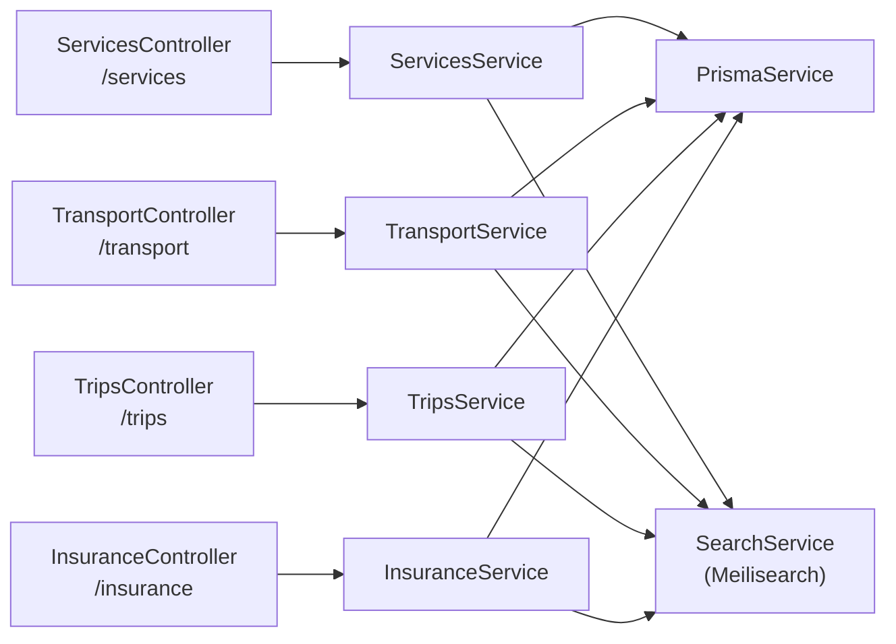
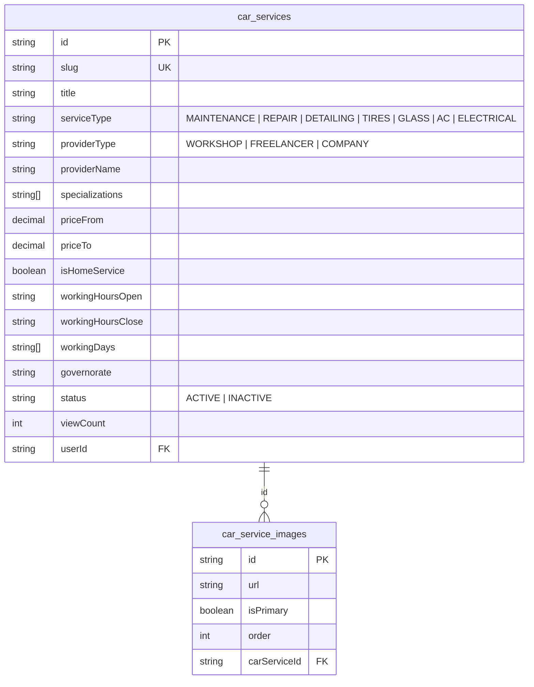
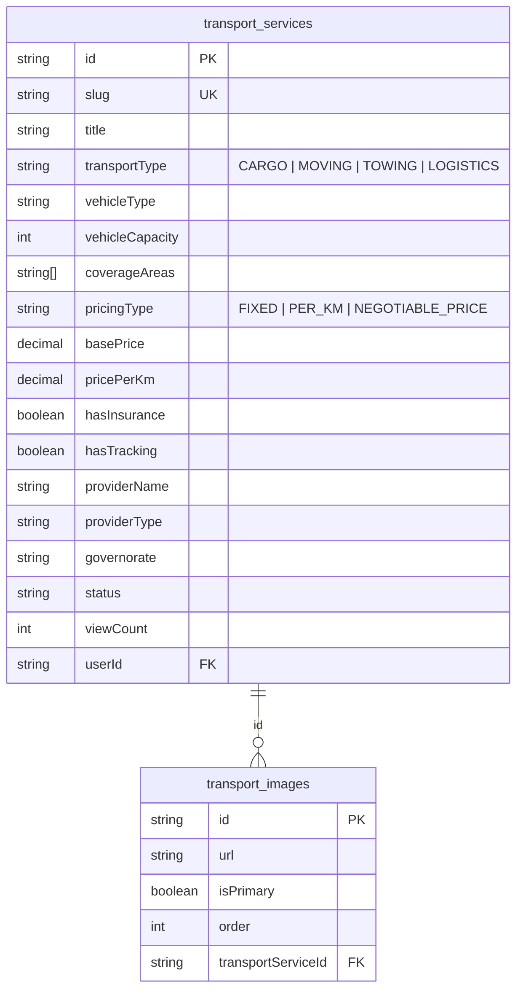
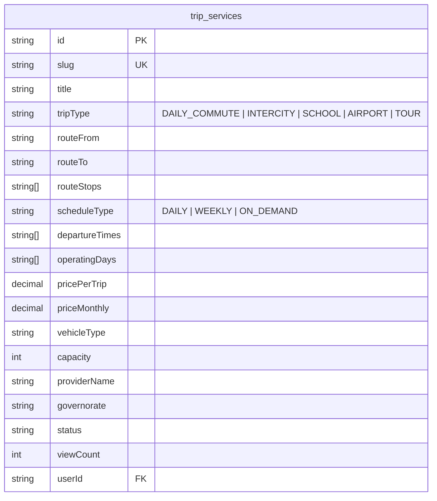
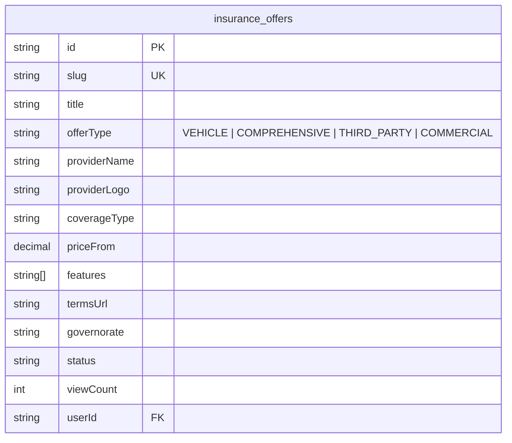

# 🔧 تقرير مراجعة — Car Services · Transport · Trips · Insurance

**النطاق:** 4 Marketplace modules — خدمات سيارات · نقل ولوجستيك · رحلات · تأمين

---

# 1. ARCHITECTURE

هذه الموديولات الأربع متشابهة جداً في البنية — نفس الـ pattern مع اختلاف الحقول فقط:



**Key Pattern:** كل module يعمل: CRUD + Meilisearch sync + generateSlug + viewCount.

---

# 2. BACKEND ANALYSIS

## 2.1 Endpoints Pattern (متطابق في الأربع)

كل module له نفس الـ 7 endpoints:

| Method | Route | Auth | الوصف |
|--------|-------|:----:|-------|
| POST | `/{module}` | ✅ | إنشاء |
| GET | `/{module}` | ❌ | تصفح (paginated + filtered) |
| GET | `/{module}/my` | ✅ | إعلاناتي |
| GET | `/{module}/slug/:slug` | ❌ | بالـ slug |
| GET | `/{module}/:id` | ❌ | تفاصيل |
| PATCH | `/{module}/:id` | ✅ | تحديث (owner) |
| DELETE | `/{module}/:id` | ✅ | حذف (owner) |

| Module | Controller Path | DB Table | Meilisearch Index |
|--------|----------------|----------|-------------------|
| Car Services | `/services` | `car_services` | `services` ✅ |
| Transport | `/transport` | `transport_services` | `transport` ✅ |
| Trips | `/trips` | `trip_services` | `trips` ✅ |
| Insurance | `/insurance` | `insurance_offers` | `insurance` ✅ |

## 2.2 Service Layer Comparison

| الجانب | Services | Transport | Trips | Insurance |
|--------|:-------:|:---------:|:-----:|:---------:|
| Repository | ❌ | ❌ | ❌ | ❌ |
| Redis Cache | ❌ | ❌ | ❌ | ❌ |
| Meilisearch | ✅ | ✅ | ✅ | ✅ |
| Notifications | ❌ | ❌ | ❌ | ❌ |
| Pagination | ✅ | ✅ | ✅ | ✅ |
| Authorization | ✅ | ✅ | ✅ | ✅ |
| Orphan cleanup | ✅ | ✅ | ✅ | ✅ |
| Search sync on CRUD | ✅ | ✅ | ✅ | ✅ |
| Slug generation | ✅ | ✅ | ✅ | ✅ |
| Image support | ✅ images table | ✅ images table | ❌ no images | ❌ no images |

---

# 3. DATABASE MODELS

## 3.1 Car Services



## 3.2 Transport



## 3.3 Trips



## 3.4 Insurance



---

# 4. FRONTEND FILES

| Module | Page | File |
|--------|------|------|
| Services | قائمة | `app/[locale]/services/page.tsx` |
| Services | تفاصيل | `app/[locale]/services/[id]/page.tsx` |
| Services | إضافة | `app/[locale]/add-listing/service/page.tsx` |
| Transport | قائمة | `app/[locale]/transport/page.tsx` |
| Transport | تفاصيل | `app/[locale]/transport/[id]/page.tsx` |
| Transport | إضافة | `app/[locale]/add-listing/transport/page.tsx` |
| Trips | قائمة | `app/[locale]/trips/page.tsx` |
| Trips | تفاصيل | `app/[locale]/trips/[id]/page.tsx` |
| Trips | إضافة | `app/[locale]/add-listing/trip/page.tsx` |
| Insurance | قائمة | `app/[locale]/insurance/page.tsx` |
| Insurance | تفاصيل | `app/[locale]/insurance/[id]/page.tsx` |
| Insurance | إضافة | `app/[locale]/add-listing/insurance/page.tsx` |

---

# 5. ISSUES DETECTION

## 🔴 Critical

| # | المشكلة | الموقع | التفاصيل |
|---|---------|--------|----------|
| SV1 | **viewCount manipulation** | كل الـ 4 services في `findOne()` | يزيد بدون rate-limit |
| SV2 | **myServices() without pagination** | كل الـ 4 services | يرجع كل الإعلانات |

## 🟡 Medium

| # | المشكلة | الموقع | التفاصيل |
|---|---------|--------|----------|
| SV3 | **No Redis cache** | كل الـ 4 modules | DB مباشرة لكل request |
| SV4 | **4 copies of generateSlug()** | services, transport, trips, insurance | تكرار كامل |
| SV5 | **No UpdateDto** | الأربع modules | `Partial<CreateDto>` |
| SV6 | **Manual field mapping in update()** | services only | `for...of Object.entries()` pattern — أفضل من if/if لكن unsafe |
| SV7 | **No notifications** | كل الـ 4 | لا يوجد إشعارات عند أي event |
| SV8 | **Trips/Insurance without images** | trips, insurance | لا يدعمون صور |

## 🟢 Low / Code Smell

| # | المشكلة | التفاصيل |
|---|---------|----------|
| SV9 | **4 identical service structures** | يمكن استخراج Base/Generic service |
| SV10 | **Search sync inconsistency** | Services/Transport sync images URL, Trips/Insurance لا |
| SV11 | **No status management** | لا يوجد endpoint لتغيير الحالة (ACTIVE → INACTIVE) |

---

# 6. PRIORITY FIX PLAN

| Priority | # | الإصلاح | الجهد |
|----------|---|---------|-------|
| 🔴 | 1 | viewCount rate-limit for all 4 modules | 2h |
| 🔴 | 2 | Pagination for all my*() methods | 30min |
| 🟡 | 3 | Redis cache (shared pattern) | 3h |
| 🟡 | 4 | Extract shared `BaseListingService` | 4h |
| 🟡 | 5 | Add image support for Trips + Insurance | 2h |
| 🟢 | 6 | Status toggle endpoint | 1h |
| 🟢 | 7 | Notifications on status changes | 2h |

---

# 7. REFACTORING SUGGESTION — Generic Base Service

الأربع modules متطابقين في الـ structure. يمكن إنشاء `BaseListingService<T>`:

```typescript
// Pseudo-code
abstract class BaseListingService<TCreate, TQuery> {
  abstract readonly model: PrismaDelegate;
  abstract readonly meiliIndex: IndexName;

  generateSlug(title: string): string { /* shared */ }
  async create(dto: TCreate, userId: string) { /* shared CRUD + meili sync */ }
  async findAll(query: TQuery) { /* shared pagination */ }
  async findOne(id: string) { /* shared + viewCount */ }
  async my(userId: string, page: number, limit: number) { /* shared */ }
  async update(id: string, userId: string, dto: Partial<TCreate>) { /* shared */ }
  async remove(id: string, userId: string) { /* shared + orphan cleanup */ }
}

class ServicesService extends BaseListingService<CreateServiceDto, QueryServicesDto> { }
class TransportService extends BaseListingService<CreateTransportDto, QueryTransportDto> { }
```

**الفائدة:** يقلل ~600 lines من duplicated code إلى ~150 lines مشتركة.

---

# 8. POSITIVE FINDINGS ✅

- **Meilisearch integration** — كل الأربع modules متزامنة مع Meilisearch (عكس Buses/Equipment)
- **Fire-and-forget search sync** — `.catch(() => {})` لا يوقف الـ response
- **Orphan cleanup** — عند حذف أي كيان
- **Remove from Meilisearch on delete** — تنظيف الـ index عند الحذف
- **Rich data models** — حقول متخصصة لكل نوع (routes لـ trips, coverage لـ transport, etc.)
- **Decimal handling** — `Prisma.Decimal` للأسعار — ✅ دقيق
